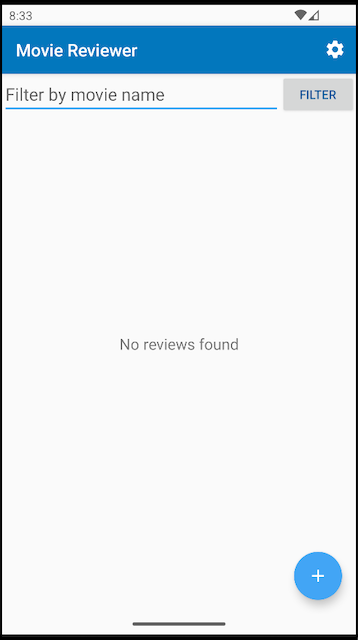
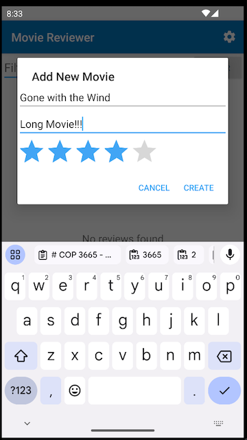
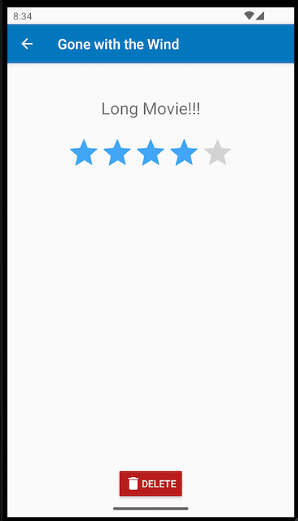
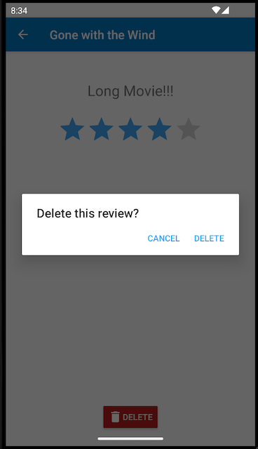
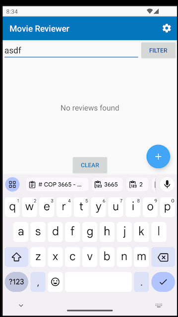
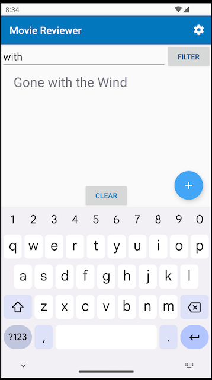

# COP 3665 - Mobile Programming

# Project 3 - Movie Reviewer

## Objective:

This project is meant to help you learn to use a local database to store your application data. This
app has many interactive elements that you must be able to create and operate successfully.

## Learning Outcomes:

- Using activities and fragments to implement CRUD functionality in an app.
- Learning to use the Room database tools, including an entity, DAO, and a Repository.
- Handling button actions and user form data.
- Implementing a settings menu.

## Preparation:

To complete this project, you need to make sure that you have read and watched all material from
chapters 6 and 7 and are comfortable with these apps: "Band Database", "To-Do List", and "Study Helper".

You also need to be familiar with these concepts:

- Buttons and click events, including the FAB
- The app bar and navigation
- Menus and dialogs
- Activities and Fragments, calling and passing data between them
- Room persistence library and the Repository / DAO patterns
- ViewModels
- LiveData (optional, but recommended)
- Recycler View (-possibly- you may choose a different approach)
- App settings 

## Problem Description:

You are asked to create a movie review app that lets a user record the name of a movie they have
watched along with a brief description and a star rating. The app _must_ use the local Room database
features introduced in chapter 7. Users should be able to view a list of their reviews, and tap
on a specific movie to see the details. They should also be able to delete a review. Finally,
users should be able to filter their list of movies by movie name.

## Overview of the Interface:

- The app should start with a main screen that is a list of user reviews.
  - At first there will not be any reviews, so the app should display "No reviews found"
- There should be a "FAB" (Floating Action Button) in the bottom-right corner of the app
  - This should have a plus sign in it (graphics are pre-loaded in the drawable folder)
  - Clicking on the FAB should bring up a form for the user to add a movie.
- Adding a movie can be done in a dialog box or in a separate activity
  - Collect the following info from the user: movie name, movie review (description), movie rating
  - The movie rating _must_ use a RatingBar to give the movie between 0-5 stars (half stars are ok)
  - Once a movie has been added to the Room database, you should take the user back to the home screen. The new movie must be present there.
    - You _must_ use the Room library and the DAO / Repository patterns. LiveData is optional but recommended.
- The home screen should display a list of the names of movies you've reviewed
  - The movies should be shown in a scrolling format. If more movies exist than can be shown, the user should be able to scroll down to see them.
    - Ideally this should be done in a Recycler view, though I'm open to other approaches.
- Clicking on a movie name should take you to a movie detail page
  - On the detail page, you should see the name of the movie (can be in the app bar)
  - You should also show the description and the star rating as read-only (set the isIndicator to true)
- There should be a delete button on the detail page
  - Clicking this button should trigger a dialog box that asks "are you sure?" before proceeding. 
    - It should have "cancel" and "delete" options
  - Once the user clicks delete on the dialog box, it should:
    - Delete the record from the database
    - Take you to the home screen
    - Display a toast or other sort of message confirming the deletion
- There should be a settings activity that is accessible from a gear icon in the top-right of the app bar.
  - The settings activity should allow the user to change the app to use a dark mode theme.
  - You must create both a light and dark theme for the app and allow this activity to toggle between them.
  - (See sections 7.9 and 7.10 for instructions on how to do this)

### Extra credit feature: Filtering (10 points)
For extra credit, you should implement a filtering feature:
- Add a filter text field and button at the top of the page
- The text field should have help text that says "Filter by movie name"
- When the filter button is clicked:
  - Check to see if there is filter text in the field
  - Filter all the movies in the DB to only show those that match the string (should be case-insensitive)
  - Show a clear button on the bottom
- When the clear button is clicked, the filtered movies disappear and the entire list is restored
- If you filter for text that has no movie results, show the same "No reviews found" message as before

### Sample run of program and photos

Here's a video showing the solution in action.

<video width="542" height="958" controls>
  <source src="demo_video/project-3-demo.mp4" type="video/mp4">
</video>

Here are some other photos as well:

## Additional Requirements:
You have a certain degree of freedom when implementing this app. You may choose your own themes,
colors, and UI layouts. You need to follow the general spirit of the demo app video and screenshots.
If you have a question about your implementation or deviating from the design, please contact me.

Your application must function as described below:

1. Your program must adhere to the all requirements provided in this description.
2. Your program must perform the functionality displayed in the video.
3. Any UI constants should be kept inside their appropriate xml files (this includes strings and colors).
4. You must use the graphics that are provided for button icons. You should strive to match the layout as well.

## Important Notes:

- Projects will be graded on whether they correctly solve the problem, and whether they adhere to good programming practices.
- Projects must be received by the time specified on the due date. Late assignments will be graded based on rules found in the syllabus.
- Please review the academic honesty policy.
    - Note that viewing another student's solution, whether in whole or in part, is considered academic dishonesty.
    - Also note that submitting code obtained through the Internet or other sources, whether in whole or in part, is considered academic dishonesty.

## Submission Instructions:

1. All code must be added and committed to your local git repository *or it may not be graded*.
2. All code must be pushed to the GitHub repository created when you "accepted" the assignment.
    - After pushing, visit the web URL of your repository to verify that your code is there.
       If you don't see the code there, then we can't see it either.
3. You must submit your Github URL to the Canvas dropbox to let us know it's ready to be graded
   - You must submit the link by the deadline and not make further commits to Github after that time.
   - If you do not submit this URL, I will consider your app late and follow syllabus policies.
4. Your code must compile and run in a Pixel 2 emulator *as shown in the lectures or it might not be graded*.
    - If your program will not compile, the grader will not be responsible for trying to test it.